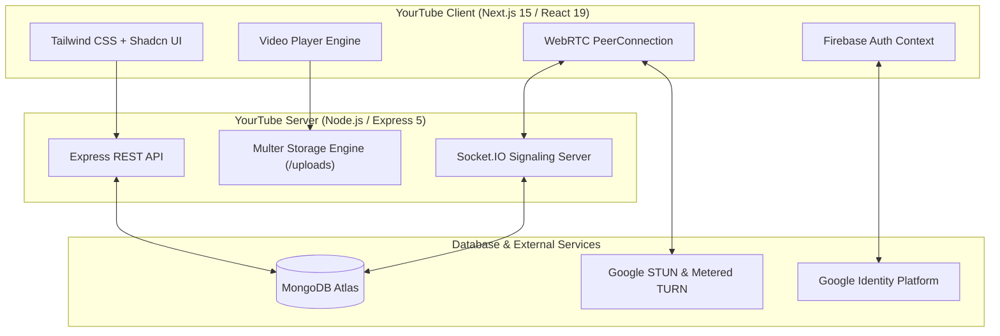

# 🎥 YourTube — Full-Stack Video Sharing & Real-Time Video Conferencing Platform

[](https://nextjs.org/)
[](https://react.dev/)
[](https://nodejs.org/)
[](https://expressjs.com/)
[](https://www.mongodb.com/)
[](https://socket.io/)
[](https://webrtc.org/)
[](https://firebase.google.com/)
[](https://tailwindcss.com/)
[](https://www.typescriptlang.org/)

**YourTube** is a modern, high-performance multimedia platform that unites the core experiences of **YouTube** (video sharing, adaptive streaming, channels, subscriptions, watch history, and comments) and **Google Meet** (multi-peer WebRTC video conferencing, screen sharing, in-call chat, and reactions) into a single, cohesive full-stack web application.

---

## 📑 Table of Contents
- [✨ Key Features](#-key-features)
  - [📺 YouTube Video Platform](#-youtube-video-platform)
  - [📹 Real-Time WebRTC Video Meetings](#-real-time-webrtc-video-meetings)
  - [🔐 Authentication & Privacy](#-authentication--privacy)
- [🏗️ System Architecture](#️-system-architecture)
- [🛠️ Technology Stack](#️-technology-stack)
- [📂 Repository Structure](#-repository-structure)
- [🚀 Getting Started](#-getting-started)
  - [Prerequisites](#prerequisites)
  - [1. Clone Repository](#1-clone-repository)
  - [2. Backend Setup](#2-backend-setup)
  - [3. Frontend Setup](#3-frontend-setup)
- [📡 REST API Reference](#-rest-api-reference)
- [⚡ WebRTC Signaling Protocol](#-webrtc-signaling-protocol)
- [⚙️ Environment Variables Reference](#️-environment-variables-reference)
- [🤝 Contributing](#-contributing)
- [📄 License](#-license)

---

## ✨ Key Features

### 📺 YouTube Video Platform
* **Video Uploading & Streaming**: Upload videos with real-time progress bars and chunked multipart upload handling via Multer.
* **Custom Interactive Player**: Feature-rich video player with custom play/pause, scrubbable seekbar, volume control, time duration counters, and fullscreen mode.
* **Channel Management**:
  * Create custom channels with names and descriptions.
  * Channel profile pages displaying all uploaded videos, banner placeholders, and live subscriber metrics.
* **Engagement & Social Systems**:
  * **Like / Dislike**: Real-time counter updates with optimistic UI updates.
  * **Comments System**: Threaded comments with timestamps, user profile avatars, and delete capabilities for video creators.
  * **Subscriptions**: Subscribe/Unsubscribe to channels with automatic live subscriber updates.
* **Personalized Library**:
  * **Subscriptions Feed**: Dedicated feed showcasing videos exclusively from creators you follow.
  * **Watch Later**: One-click saving to your private Watch Later list.
  * **Watch History**: Automatic tracking and review of watched videos.
  * **Liked Videos**: Curated playlist of your favorited videos.
* **Exploration & Search**:
  * Live search bar querying video titles, descriptions, and uploader names.
  * Dynamic category filter tags for instant topic browsing.
* **Responsive Multi-Device UI**:
  * Collapsible desktop sidebar drawer and compact icon mode.
  * Native app-style bottom navigation bar (`MobileBottomNav`) optimized for smartphones and tablets.

---

### 📹 Real-Time WebRTC Video Meetings
* **Instant & Scheduled Rooms**: Launch a meeting in seconds or share a unique 9-character room code / URL link.
* **Pre-Join Green Room**: Preview camera and microphone inputs and test hardware before joining calls.
* **Multi-Peer WebRTC Mesh Network**:
  * Automated peer-to-peer audio and video streaming with W3C Perfect Negotiation glare resolution.
  * Comprehensive NAT traversal using Google STUN and OpenRelay TURN servers across UDP, TCP, and TLS ports 80/443.
* **Meeting Controls & Collaboration**:
  * 🎙️ **Microphone & Camera Toggles**: One-click device muting with live audio track monitoring.
  * 🖥️ **HD Screen Sharing**: Share screen or application windows with optional system audio.
  * 🔴 **Meeting Recording**: Record entire meeting sessions directly inside the browser with WebM export.
  * 💬 **Live Meeting Chat**: Real-time Socket.IO chat with peer file sharing (images, documents, PDFs).
  * 🎉 **Animated Reactions**: Floating emoji reactions (👏, ❤️, 👍, 🎉, 😂, 🔥) with smooth CSS physics.
* **Host & Security Suite**:
  * Host badge and privileges: end meeting for all or leave individually.
  * Room locking to prevent unwanted access.
  * Host toggles to enable or disable participant screen sharing and chat.

---

### 🔐 Authentication & Privacy
* **Firebase Google Authentication**: One-click Google OAuth Single Sign-On (SSO) with persistent local sessions.
* **Zero Hardcoded Secrets**: All sensitive keys, database URIs, and endpoints are securely loaded via `.env` files and guarded by `.gitignore`.

---

## 🏗️ System Architecture



---

## 🛠️ Technology Stack

| Domain | Technology | Purpose |
|---|---|---|
| **Frontend** | Next.js 15, React 19, TypeScript | High-performance React application with Pages router |
| **Styling** | Tailwind CSS 3.4, Shadcn UI | Modern responsive interface, fluid animations |
| **Icons & Notifications** | Lucide Icons, Sonner | Minimalist iconography and toast alerts |
| **Backend** | Node.js, Express.js 5 | REST API server and multipart upload handling |
| **Real-Time** | Socket.IO 4.8 | WebRTC signaling, live chat, and reactions |
| **Media Transport** | WebRTC (RTCPeerConnection) | Low-latency audio, video, and screen sharing |
| **Database** | MongoDB Atlas, Mongoose 8 | Document storage for users, videos, channels, and meetings |
| **Authentication** | Firebase Authentication | Google OAuth 2.0 Single Sign-On |
| **Media Storage** | Multer | Multipart video and meeting file storage |

---

## 📂 Repository Structure

```text
youtube_c/
├── yourtube/                     # Next.js Client & Frontend
│   ├── public/                   # Static assets, logos, and icons
│   ├── src/
│   │   ├── components/           # UI components
│   │   │   ├── meet/             # Video meeting components (VideoTile, Chat, Controls)
│   │   │   ├── ui/               # Reusable UI primitives (dialog, button, avatar, etc.)
│   │   │   ├── Header.tsx        # Navigation header with search and action icons
│   │   │   ├── Sidebar.tsx       # Responsive drawer navigation
│   │   │   ├── Videopplayer.tsx  # Custom HTML5 video player
│   │   │   ├── VideoUploader.tsx # Video upload modal with progress
│   │   │   └── ...
│   │   ├── lib/                  # Shared libraries, contexts, and WebRTC hook
│   │   │   ├── webrtc/           # useMeetingRoom.ts (WebRTC state machine)
│   │   │   ├── AuthContext.js    # Firebase auth state & session provider
│   │   │   └── firebase.js       # Firebase SDK initialization
│   │   └── pages/                # Next.js routes
│   │       ├── index.tsx         # Video home feed
│   │       ├── watch/[id]/       # Watch video page
│   │       ├── meet/             # Video meeting lobby & room pages
│   │       ├── channel/[id]/     # Channel profile & upload page
│   │       ├── subscriptions/    # Subscriptions feed
│   │       └── ...
│   ├── .env.example              # Frontend environment variables template
│   └── package.json
│
├── server/                       # Node.js Express Backend
│   ├── controllers/              # REST controllers (auth, video, comments, likes, meet)
│   ├── Modals/                   # Mongoose data models
│   ├── routes/                   # Express API routes
│   ├── filehelper/               # Multer configurations for videos and meeting files
│   ├── socket.js                 # WebRTC signaling server & real-time socket events
│   ├── index.js                  # Express server entry point
│   ├── .env.example              # Backend environment variables template
│   └── package.json
│
├── .gitignore                    # Global git ignore (secures secrets & node_modules)
└── README.md                     # Project documentation
```

---

## 🚀 Getting Started

### Prerequisites
Make sure you have installed on your machine:
* [Node.js](https://nodejs.org/) (v18.x or newer)
* [npm](https://www.npmjs.com/) or [yarn](https://yarnpkg.com/)
* A [MongoDB Atlas](https://www.mongodb.com/) database connection URI
* A [Firebase Project](https://console.firebase.google.com/) for Google Sign-In

---

### 1. Clone Repository
```bash
git clone https://github.com/Nikhil-Ravula/youtube-clone-fullstack.git
cd youtube-clone-fullstack
```

---

### 2. Backend Setup
1. Open a terminal and navigate to `server`:
   ```bash
   cd server
   npm install
   ```

2. Create your `.env` configuration file:
   ```bash
   cp .env.example .env
   ```

3. Update `server/.env` with your MongoDB connection string:
   ```env
   PORT=5000
   DB_URL=mongodb+srv://<username>:<password>@cluster.mongodb.net/yourtube?retryWrites=true&w=majority
   ```

4. Start the backend server:
   ```bash
   npm start
   ```
   *The backend will be running at `http://localhost:5000` with Socket.IO enabled.*

---

### 3. Frontend Setup
1. Open a separate terminal and navigate to `yourtube`:
   ```bash
   cd yourtube
   npm install
   ```

2. Create your `.env.local` configuration file:
   ```bash
   cp .env.example .env.local
   ```

3. Fill in your Firebase credentials in `yourtube/.env.local`:
   ```env
   BACKEND_URL=http://localhost:5000
   NEXT_PUBLIC_BACKEND_URL=http://localhost:5000

   # Firebase Client Credentials (from Firebase Console)
   NEXT_PUBLIC_FIREBASE_API_KEY=your_firebase_api_key
   NEXT_PUBLIC_FIREBASE_AUTH_DOMAIN=your_project.firebaseapp.com
   NEXT_PUBLIC_FIREBASE_PROJECT_ID=your_project_id
   NEXT_PUBLIC_FIREBASE_STORAGE_BUCKET=your_project.firebasestorage.app
   NEXT_PUBLIC_FIREBASE_MESSAGING_SENDER_ID=your_messaging_sender_id
   NEXT_PUBLIC_FIREBASE_APP_ID=your_app_id
   NEXT_PUBLIC_FIREBASE_MEASUREMENT_ID=your_measurement_id
   ```

4. Launch the Next.js development server:
   ```bash
   npm run dev
   ```
   *Visit [http://localhost:3000](http://localhost:3000) in your web browser.*

---

## 📡 REST API Reference

### 🔐 Authentication (`/user`)
| Method | Endpoint | Description |
|---|---|---|
| `POST` | `/user/login` | Authenticate or register a user session via Google SSO |
| `PATCH` | `/user/update/:id` | Update channel name and description |
| `GET` | `/user/get/:id` | Retrieve user profile by user ID |

### 🎬 Videos (`/video`)
| Method | Endpoint | Description |
|---|---|---|
| `POST` | `/video/uploadvideo` | Multipart upload for video files and metadata |
| `GET` | `/video/getallvideo` | Retrieve all uploaded videos |
| `PATCH` | `/video/views/:id` | Increment view counter for a specific video |

### 💬 Comments & Likes (`/comment`, `/like`)
| Method | Endpoint | Description |
|---|---|---|
| `POST` | `/comment/postcomment` | Post a comment on a video |
| `GET` | `/comment/getallcomment/:videoid` | Fetch all comments for a video |
| `DELETE` | `/comment/deletecomment/:id` | Remove a comment |
| `PATCH` | `/like/:videoid` | Toggle like status on a video |
| `GET` | `/like/getalllike` | Fetch user liked videos |

### 📹 Meetings (`/meeting`)
| Method | Endpoint | Description |
|---|---|---|
| `POST` | `/meeting/create` | Create a new video meeting room |
| `GET` | `/meeting/validate/:roomId` | Verify room status and permissions |
| `POST` | `/meeting/upload` | Upload and share a file attachment inside the meeting |

---

## ⚡ WebRTC Signaling Protocol

The platform implements real-time WebRTC mesh communication with Socket.IO signaling:

```text
Peer A                                   Signaling Server (Socket.IO)                                Peer B
  |                                                  |                                                  |
  |--- join-room (roomId, user) -------------------->|                                                  |
  |                                                  |--- user-joined (Peer A info) ------------------->|
  |                                                  |<-- join-room (roomId, user) ---------------------|
  |                                                  |                                                  |
  |--- offer (SDP) --------------------------------->|--- offer (SDP) --------------------------------->|
  |                                                  |<-- answer (SDP) ---------------------------------|
  |<-- answer (SDP) ---------------------------------|                                                  |
  |                                                  |                                                  |
  |<=== [Direct Peer-to-Peer Encrypted Audio/Video/Screen Stream via WebRTC] ==========================>|
  |                                                  |                                                  |
  |--- ice-candidate ------------------------------->|--- ice-candidate ------------------------------->|
  |<-- ice-candidate --------------------------------|<-- ice-candidate --------------------------------|
```

---

## ⚙️ Environment Variables Reference

### Backend (`server/.env`)
| Variable | Required | Description |
|---|---|---|
| `PORT` | Yes | Express server port (default: `5000`) |
| `DB_URL` | Yes | MongoDB Atlas cluster connection string |

### Frontend (`yourtube/.env.local`)
| Variable | Required | Description |
|---|---|---|
| `NEXT_PUBLIC_BACKEND_URL` | Yes | URL of the backend API (e.g. `http://localhost:5000`) |
| `NEXT_PUBLIC_FIREBASE_API_KEY` | Yes | Firebase Web API key |
| `NEXT_PUBLIC_FIREBASE_AUTH_DOMAIN` | Yes | Firebase Auth domain (`project.firebaseapp.com`) |
| `NEXT_PUBLIC_FIREBASE_PROJECT_ID` | Yes | Firebase project ID |
| `NEXT_PUBLIC_FIREBASE_STORAGE_BUCKET` | Yes | Firebase Storage bucket URI |
| `NEXT_PUBLIC_FIREBASE_MESSAGING_SENDER_ID` | Yes | Firebase Cloud Messaging Sender ID |
| `NEXT_PUBLIC_FIREBASE_APP_ID` | Yes | Firebase Web Application ID |
| `NEXT_PUBLIC_FIREBASE_MEASUREMENT_ID` | Optional | Google Analytics Measurement ID |

---

## 🤝 Contributing
Contributions, feedback, and feature requests are welcome!
1. Fork the repository
2. Create your feature branch: `git checkout -b feature/MyFeature`
3. Commit your changes: `git commit -m 'Add MyFeature'`
4. Push to the branch: `git push origin feature/MyFeature`
5. Open a Pull Request

---

## 📄 License
This project is open-source and available under the [MIT License](LICENSE).
